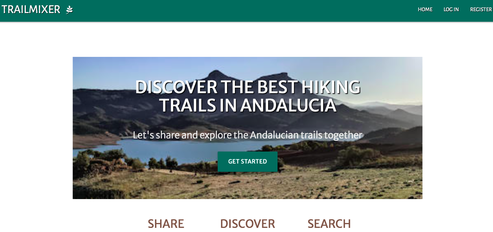
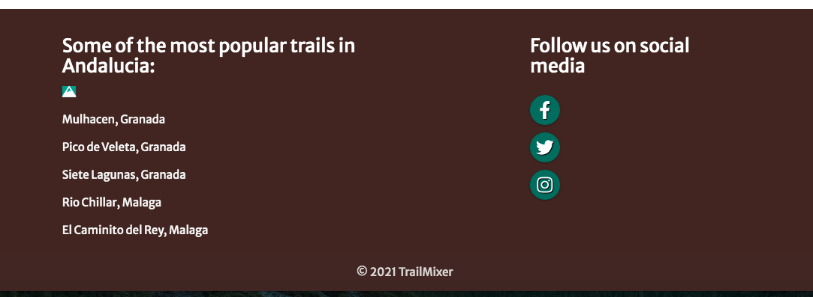
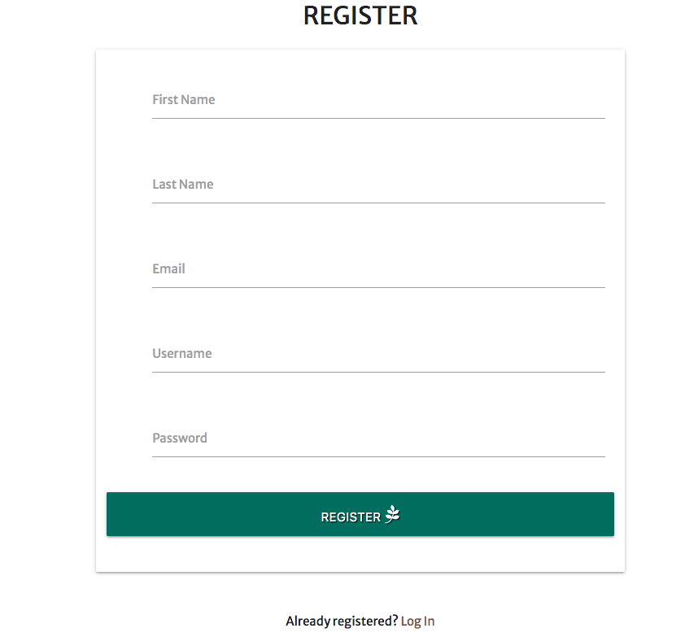
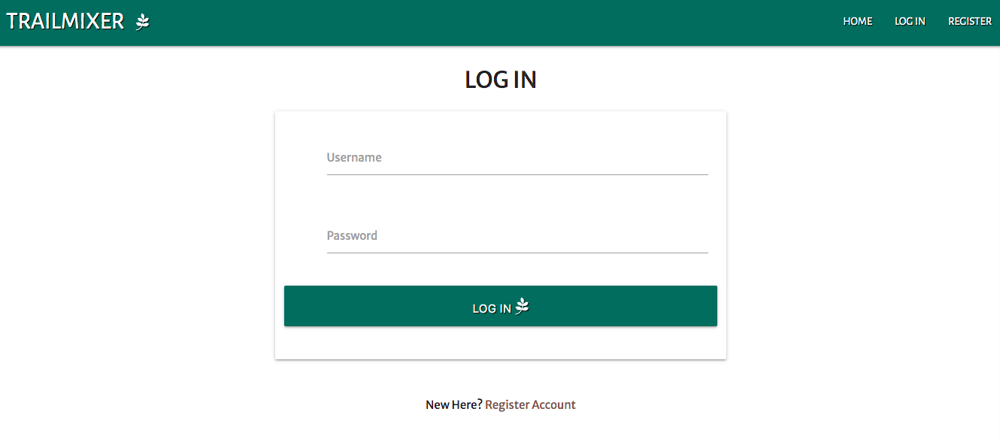
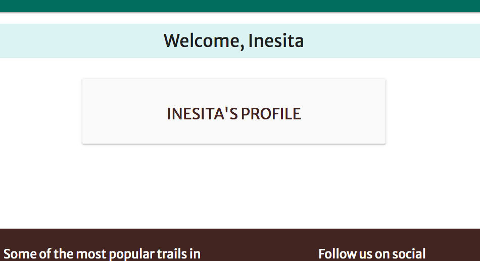
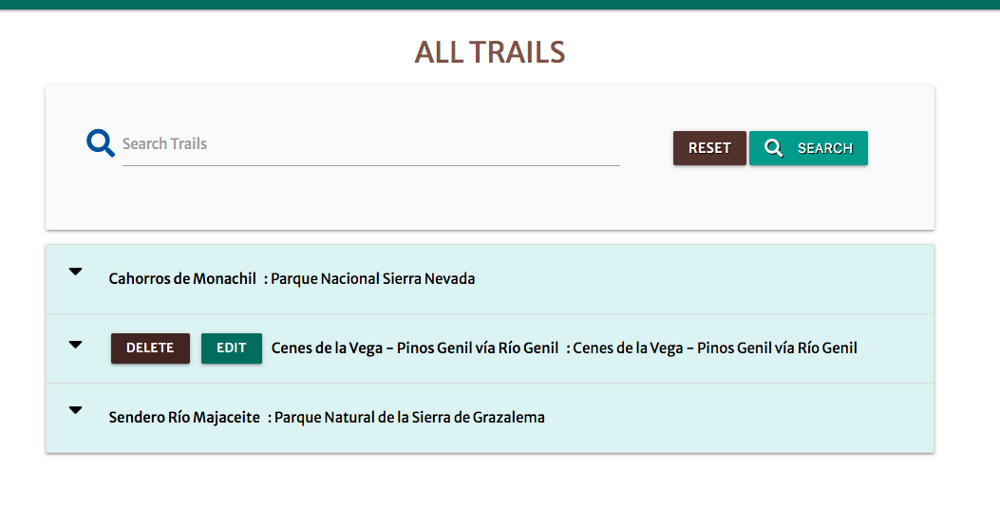
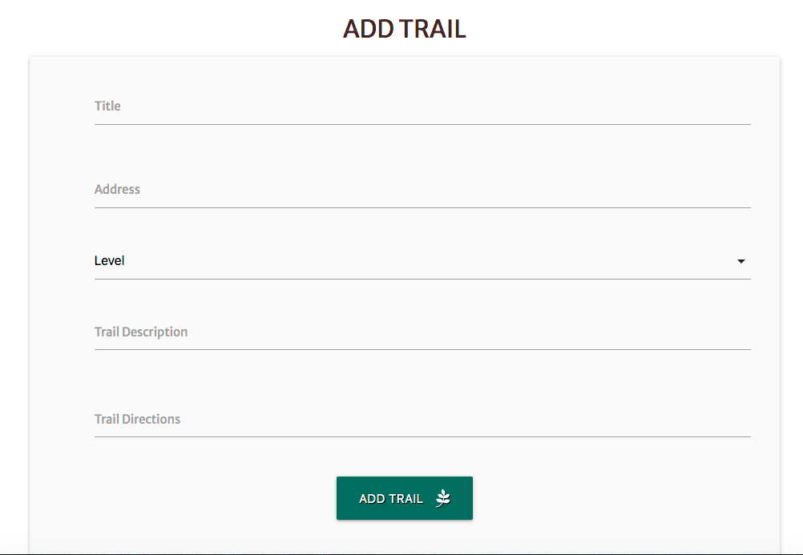
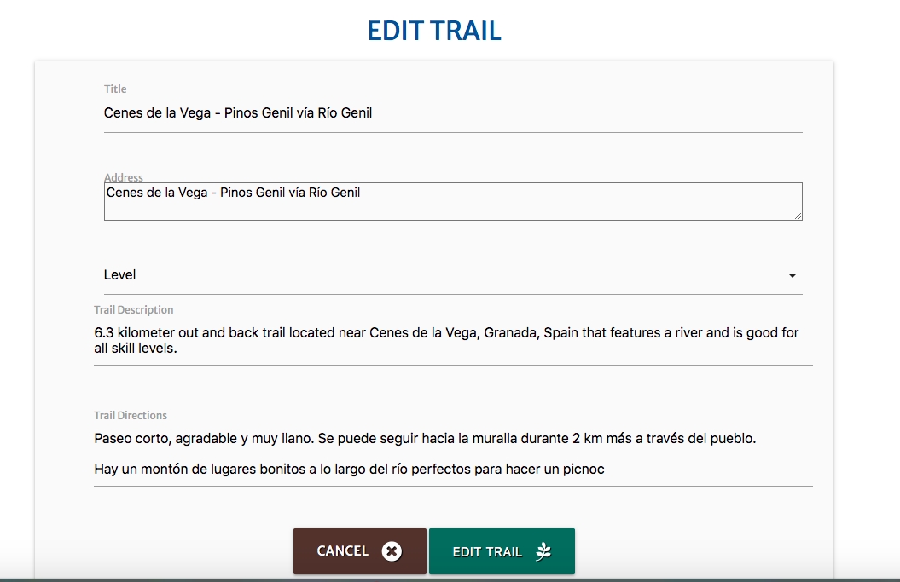
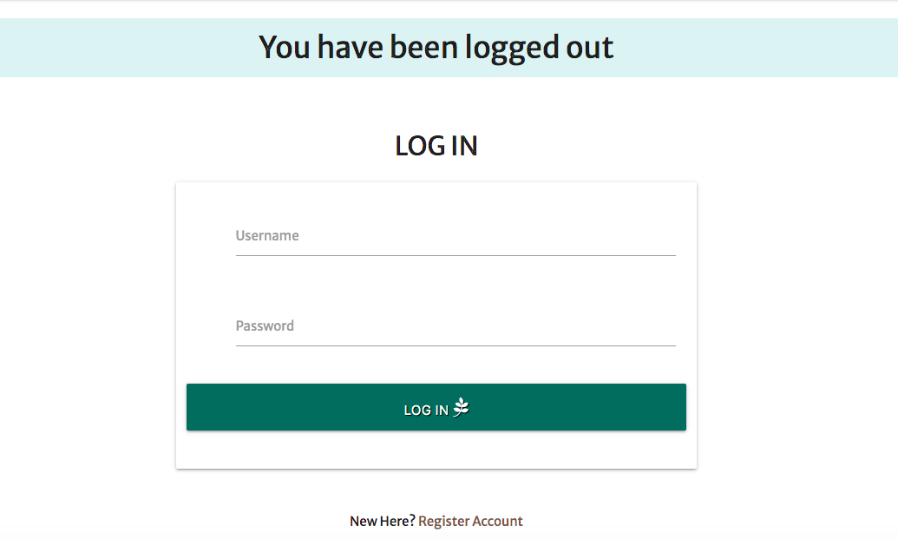

# TrailMixer

### Overview 

TrailMixers is a website where users can add, edit, delete and search hiking trails in the Province of Andalucia, Spain. They can also upload photos and maps showing their trails. 
Each route will provide:

- A title
- Address of the trail
- Difficulty level, Easy, moderate or hard
- Description
- Directions
- Photos
- Maps

The site will also provide a comment section where users can give opinions or tips and advice on the trails, where to eat, sleep nearby etc.

I have created two profiles for testing purposes:
1. Username:Inesita, Password:inesita
2. Username:Admin, Password:admin

 [View Live Site Here](https://trailmixers-project3.herokuapp.com/)

## Contents

[Overview](#overview)
* [UX](#ux)
    * [Project Goals](#project-goals)
    * [User Goals](#user-goals)
    * [User Stories](#user-stories)
    * [Site Owner Goals](#site-owner-goals)
    * [User requirements and expectations](#User-requirements-and-expectations)

* [DESIGN](#design)
    * [Design Choices](#design-choices)
    * [Colors](#colors)
    * [Fonts](#fonts)
    * [Structure](#structure)

* [WIREFRAMES](#wireframes)
    
#### Mobile

* [Home](#mobile-home)
* [Get_started](#mobile-get_started)
* [Sign_in](#mobile-sign_in)
* [Sign_up](#mobile-sign_up)
* [Add](#mobile-add)
* [Member_page](#mobile-member_page)
* [Trail_data](#mobile-trail_data)

#### Desktop

* [home](#desktop-home)
* [Get_started](#desktop-get_started)
* [Sign_in](#desktop-sign_in)
* [Sign_up](#desktop-sign_up)
* [Member_page](#desktop-member_page)

* [TECHNOLOGIES USED](#technologies)

    * [Github](#github)
    * [Gitpod](#gitpod)
    * [Google Fonts](#google-fonts)
    * [Font Awesome](#font-awesome)
    * [Bootstrap CDN](#bootstrap)
    * [jQuery](#jquery)
    * [Popper.js](#popper.js)
    * [WAVE](#wave)
    * [W3 HTML](#w3-html)
    * [Jigsaw CSS](#jigsaw-css)
    * [Balsamic](#balsamic)
    * [HTML Beautifier](#html-beautyfier)

* [TESTING](#testing)

* [BUGS](#bugs)

* [DEPLOYMENT](#deployment)

* [CREDITS](#credits)

 
### UX 

#### Project Goals 

The goal of this project is to utilize the skills aquired throughout the course so far to build a full-stack site that allows users to manage and share data on hiking trails in Andalucia. 

The site should provide users with information on Andalucian trails and also give the oppportunity to create a community where users can share their experiences.

A possible benefit for the owner of the site could be to obtain revenue from advertising through affiliated links and sponsorship. 

#### User Goals

1. To be able to search and browse through trails in Andalucia.

2. Find all the information necessary for each trail like distance, difficulty level, address and directions.

3. To create a personal profile to upload and store trails.

4. To be able to register and create a profile easily.

5. Find out more information on potential trails by reading comments and asking questions.

6. Become part of a hiking community and give tips and advice to other hikers.

7. To view photos of the trails and surrounding areas.

#### User Stories

8. As a hiker I want to be able to find interesting and off the beaten track trails used by other members of the site.

9. As a regular user I want to be able to upload my own trails to share with the community and get opinions on my trail.

10. As someone who is interested in hiking in Andalucia I want to find trails that will suit my needs.

11. As someone who isn't used to hiking I would like to find trails which are easy to moderate level.

12. As a very experienced hiker, I hope to find difficult trails that will challenge me.

13. As a regular user I hope to meet other users who live in my area and can organise hikes together.

14. As a user I would like to be able to see more posts and photos on the sites social media sites.

#### Site Owner Goals

15. Design a site which represents the services offered and will appeal to the target market using appropriate colour schemes, imagery, typography and useful information.

16. Ensure the site is easy to navigate and all information can be found by visitors within seconds.

17. Ensure the registration process is simple and fast.

18. Increase website traffic from the target audience using tools such as google analytics, blogging and social media.

19. Produce a site which is easily accessible on all sizes, mobile devices and browsers.

20. To eventually gain revenue from the site through affiliated links and advertsiing. Potential clients could be sports shops, hotels ,restaurants and tour companies.

#### User Requirements and expectations

21. A fast loading time.

22. A website which is clear and easy to navigate.

23. Recognisable format, no surprises.

24. A well designed, aesthetically pleasing user interface.

25. For all navigation links to function correctly and create an easy route.

26. All information added is saved and easily accessible. 

### DESIGN 

#### DESIGN CHOICES

I have used a clean, simple design throughout the site to make it easily accessible across all mediums and give the user the information they need without feeling overwhelmed by too many images and too much information.

#### COLOURS

I chose this color scheme as it reflects the colours of nature while assuring readabilty and accessability. I think these shades of green and brown go well together and are in line with the simplistic design of the site.

-  `#00695c`
-  `#3e2723`

#### FONTS

The fonts I use for this project are Alegreya Sans and Merriweather Sans. These fonts compliment each other well and create a pleasant feel for users. 

#### IMAGES

Images used on the landing page were borrowed from a friend Lena Marie Anderson from a trail she hiked in Cadiz, Guadalete Park, Andalucia. 

### WIREFRAMES 

#### Mobile

* [mobile-home](static/docs/wireframes/mobile/home.png)
* [mobile-get_started](static/docs/wireframes/mobile/get_started.png)
* [mobile-sign_in](static/docs/wireframes/mobile/sign_in.png)
* [mobile-sign_up](static/docs/wireframes/mobile/sign_up.png)
* [mobile-add](static/docs/wireframes/mobile/add.png)
* [mobile-member_page](static/docs/wireframes/mobile/member_page.png)
* [mobile-trail_data](static/docs/wireframes/mobile/trail_data.png)

#### Desktop

* [desktop-home](static/docs/wireframes/desktop/home_desktop.png)
* [desktop-get_started](static/docs/wireframes/desktop/get_started_desktop.png)
* [desktop-sign_in](static/docs/wireframes/desktop/sign_in_desktop.png)
* [desktop-sign_up](static/docs/wireframes/desktop/sign_up_desktop.png)
* [desktop-member_page](static/docs/wireframes/desktop/member_page_desktop.png)

### FEATURES 

#### Feature 1: Home Page

* Home page navbar accessible to non registered users and users before they log in.

* Navbar accessible to logged in users. Once you log in you have access to trails and the ability to create your own trail, read it, edit it and delete it based on CRUD functionality.

* Get started button which leads you to the log in page which has a register button for users who haven't registered yet

* The footer at the bottom of the page has live links for the most popular trails in Andalucia. It also dislays the social media links.

* This is the registration page where potential users can add their name, surname, email, username and password, which will be stored on the database.

* Once registered the user can log in here.

* And they will be directed to their profile page with a welcome message based on their username

* From here the user can click on to the trails button to view all trails

* Or click on the Add Trail button in the navbar to add their own trail.

* The user can search for a trail already saved in the database.

* Or edit or delete a trail they have already created by clicking on one of these buttons

* To edit, the user needs to ammend their trail using this form and press edit or cancel if they change their mind or rather do it later.

* When the user is finished on the site they can click on the log out button on the navbar and be redirected to the homepage with a message telling them they have logged out successfully.

### DATABASE 

This is a data-centric website using html, javascript, jQuery and  css used with materialize framework as a frontend
The backend consists of Python, flask and jinja templates with a database of a mongodb open-source document-oriented database

MongdoDB was used to create the database.
The MongoDB database holds the following information: -

# Trails Collection

Key                | Value     | Information
-------------------|-----------|-------------
_id                | ObjectId  | Automatically generated by MongoDB
trail_title        | String    | creates a title
trail_address      | String    | creates an address
trail_created_by   | String    | shows who added the trail
trail_description  | String    | Describes the trail
trail_difficulty   | String    | Choose a level of difficulty. Easy moderate or hard
trail_directions   | String    | Gives trail directions

# Users Collection

Key        | Value     | Information
-----------| ----------|------------------------
_id        | ObjectId  | Automatically generated by MongoDB
first_name | String    | Collects first name
last_name  | String    | collects last name
username   | String    | collects username
password   | String    | stores password

### TECHNOLOGIES USED 

Languages used:

* HTML 5
* CSS
* Javascript
* JQuery
* JQuery

- [Gitpod](https://gitpod.io) 
    - Used **Gitpod** as my open source platform.
- [Github](https://github.com/) 
    - Used **Github** as my code hosting platform
- [Google Fonts](https://fonts.google.com/)
    - This project uses **Google fonts** to style the website fonts.
- [Materialize](https://www.https://materializecss.com/.com/)
    - This project uses **Bootstrap4** to simplify the structure of the website and make the website responsive
    - This project also uses BootstrapCDN to provide icons from [FontAwesome](https://www.bootstrapcdn.com/fontawesome/)

- [jQuery](https://jquery.com/)
    - This project uses **jQuery** to reference Javascript needed for the responsive navbar.
- [Popper.js](https://popper.js.org/)
    - **Popper.js** was used to reference Javascript needed for the responsive navbar.
- [WAVE](https://wave.webaim.org)
    - Used **WAVE** to evaluate my code to ensure the content is fully accessable to individuals with disabilities.
- [W3 HTML](https://validator.w3.org/)
    - Used **W3 HTMLs** for HTML code valuation
- [Jigsaw CSS](https://jigsaw.w3.org/css-validator/)
    - Used **Jigsaw CSS** to Validate CSS Code
- [Balsamic](https://balsamiq.com/)
    - Used **Balsamic** to create [WIREFRAMES](#wireframes)
- [PEP8 Online](http://pep8online.com/)
    - **PEP8 Online** For Python code valuation
- [JS Hint](https://jshint.com/)
    - **JS Hint** For Javascript code valuation

### TESTING 

### Performance

Google Lighthouse was used to measure the speed and performance of the website. 

#### Lighthouse

* [Lighthouse Home Page](static/docs/lighthouse/lh_home.png)
* [Lighthouse Login Page](static/docs/lighthouse/lh_login.png)
* [Lighthouse Add Trail Page](static/docs/lighthouse/add_trail.png)
* [Lighthouse Register Page](static/docs/lighthouse/lh_register.png)
* [Lighthouse TrailsPage](static/docs/lighthouse/trails.png)

### Accessibility

WAVE Web Accessibility Evaluation Tool was used to test the sites accessibility.

### Validation

Validation tools used:

- https://validator.w3.org/ :HTML Validation

- https://jigsaw.w3.org/css-validator/ : CSS Validation

- http://pep8online.com/ : Python Validation

- https://jshint.com/ : JS Validator

### Validation Results

* [HTML Validation](static/docs/validation/W3_html_validator.png)

* [CSS Validation](static/docs/validation/css_validator.png)

* [Python Validation](static/docs/validation/python_validator.png)

* [Javascript Validation](static/docs/validation/JS_validator.png)

### BUGS FOUND AND THEIR FIXES 

1. The major bug I had a problem with throughout this project was with an application error everytime I tried to open my Heroku App. This was eventually fixed by removing unused files I had uploaded to my root at the beginning of my project while trying to fix an issue with my database. Heroku was trying to open these files and as a result I kept getting a H10 error and pymong was crashing. Deleting these files and cleaning up my workspace cleared the issue and Heroku runs with no problems.

2. For a while my env.py file would disappear everytime I opened my project after closing it down. I was clicking on the green gitpod button and realised I have to go to gitpod dashboard to open my workspace instead of going directly from github.

3. I had a lot of template syntax errors throughout the project which usually resulted in mistakes made with PEP8 compliance and repeating functions and empty quotes. Also typos caused me a lot of headaches and I spent many hours/days going through my code trying to spot them.

4. The python tools server crashed 3 times in the last 3 minutes was an alert I came across many times. When I deleted unused files from my root this was ammended.

5. I had a lot of issues wiring up my flask app to MongoDB at the beginning of the project. I reviewed the Go Humungous with MongoDB Atlas section of the course and manipulated my data programmatically with python to get a feel of where I was going wrong and to see the data being uploaded to my console. This helped give me a greater understanding of the database structure and I got it in the end.

    
### Deployment

## Project creation

The project was created by logging into Github, using the following steps: -
 - Create an account using an email address and password or a google account
 - Log in to account and create a new repository using Code institutes template.
 - Name the repository based on your project name and be sure to include project 3. Then click the green Gitpod button which will take you to Gitpod. 
 - Open the platform and start coding

 ## Sign-in or sign-up to MongoDB

Sign-in or sign-up to MongoDB and create a new cluster
Within the Sandbox, click the collections button and after click Create Database

I set up the following collections: comments, trails, ratings and users. However I only used the trails and users collections.

# Trails Collection

Key                | Value     | Information
-------------------|-----------|-------------
_id                | ObjectId  | Automatically generated by MongoDB
trail_title        | String    | creates a title
trail_address      | String    | creates an address
trail_created_by   | String    | shows who added the trail
trail_description  | String    | Describes the trail
trail_difficulty   | String    | Choose a level of difficulty. Easy moderate or hard
trail_directions   | String    | Gives trail directions

# Users Collection

Key        | Value     | Information
-----------| ----------|------------------------
_id        | ObjectId  | Automatically generated by MongoDB
first_name | String    | Collects first name
last_name  | String    | collects last name
username   | String    | collects username
password   | String    | stores password

Next, under the Security Menu on the left, select Database Access.

Add a new database user, and keep the credentials secure

Within the Network Access option, add IP Address 0.0.0.0

In your IDE, create a file containing your environmental variables called env.py at the root level of the application. It will need to contain the following lines and variables:

- import os

- os.environ["IP"] = "0.0.0.0"
- os.environ["PORT"] = "5000"
- os.environ["SECRET_KEY"] = "YOUR_SECRET_KEY"
- os.environ["DEBUG"] = "True"
- os.environ["MONGO_URI"] = "YOUR_MONGODB_URI"
- os.environ["MONGO_DBNAME"]= "DATABASE_NAME" 

Please note that you will need to update the SECRET_KEY with your own secret key, as well as the MONGO_URI and MONGO_DBNAME variables with those provided by MongoDB.

To find your MONGO_URI, go to your clusters and click on connect. Choose connect your application and copy the link provided. Don't forget to update the necessary fields like password and database name.

If you plan on pushing this application to a public repository, ensure that env.py is added to your .gitignore file.

The application can now be run locally. In your terminal, type the following command

python3 app.py. 

## Deploying on Heroku:

Register for your free Heroku account and create a new app. Choose your region.
Give the app your project name and choose what region you are in then click 'Create app'.
Go to the settings tab and find the Config Vars section. Click 'Reveal Config Vars'.
Ensure the Procfile and requirements.txt files exist are present and up-to-date in your local repository. For example: -

pip3 freeze --local > requirements.txt
Procfile: echo web: python app.py > Procfile
The Procfile should contain the following line:
web: python app.py

Scroll down to "deployment method"-section. Choose "Github" for automatic deployment.
From the inputs below, make sure your github user is selected, and then enter the name for your repo. Click "search". When it finds the repo, click the "connect" button.
Scroll back up and click "settings". Scroll down and click "Reveal config vars". Set up the same variables as in your env.py (IP, PORT, SECRET_KEY, MONGO_URI and MONGODB_NAME): Do not set the DEBUG variable here. This should be set to False before deployment.

- IP = 0.0.0.0
- PORT = 5000
- SECRET_KEY = YOUR_SECRET_KEY
- MONGO_URI = YOUR_MONGODB_URI
- MONGO_DBNAME = DATABASE_NAME

Scroll back up and click "Deploy". Scroll down and click "Enable automatic deployment".
Just beneath, click "Deploy branch". Heroku will now start building the app. When the build is complete, click "view app" to open it.
In order to commit your changes to the branch, use git push within gitpod to push your changes

### CHANGES TO IMPLEMENT AND INCLUDE

Due to time constraints I did not manage to create a function to upload photos and maps to the site. I would also like to include a comment section below each trail so users can give their opinion on trails, ask questions or give advice. I would like to also include a rating function so the home page can include a trail of the day based on popularity. I hope to implement these in the future.

### CREDITS

#### Code

I relied heavily on code used in the Code Institutes tutorials to help me with this project, especially Code Institutes Data-Centric mini project. I used these tutorials to guide me through the process of creating this site and all the functionality needed. I ammended the code to suit my own project.

I also used materialize to create responsive layouts. I was keen to try using this platform as it is new to me.

#### Images

Images were borrowed from a friend from her own personal collection.

 
 ### ACKNOWLEDGEMENTS

 Thank you to my mentor Mo Shami for getting me started on the project and veering me onto the right track. 
 Thank you to Code Institutes' Student care team for all their help.
 And thanks to Jo from student support who helped me greatly in fixing the problem I had with Heroku app.
